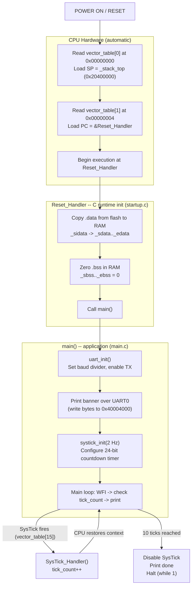

# Cortex-M3 Boot Flow (MPS2-AN385)

How this firmware goes from power-on to printing over UART — no OS, no loader, no runtime.

## Glossary

| Term | What it means |
|------|---------------|
| **Vector table** | An array of addresses at the very start of flash. The CPU reads it on boot to find the stack pointer and entry point. Think of it as the firmware's "table of contents" — entry 0 is the stack address, entry 1 is where to start running, entries 2-15 include CPU exception handlers (faults, SysTick, etc.) with some reserved slots, and entries 16+ are device-specific interrupt (IRQ) handlers. |
| **SP (Stack Pointer)** | Register that tracks the top of the call stack. On Cortex-M the stack grows *downward* — SP starts at the top of RAM and decreases as functions are called. |
| **PC (Program Counter)** | Register holding the address of the next instruction to execute. Loading `Reset_Handler` into PC is what makes the CPU start running our code. |
| **Reset_Handler** | The first function that runs after power-on. It's the bare-metal equivalent of a language runtime — sets up memory so that C code works correctly, then calls `main()`. |
| **.data section** | Global/static variables with initial values (e.g. `int x = 42`). Stored in flash (survives power loss) but must be copied to RAM before use, since RAM is where read-write variables live. |
| **.bss section** | Global/static variables with no initializer (e.g. `static int count`). The C spec guarantees these start at zero, so rather than storing zeros in flash, the startup code just zeroes this region in RAM. |
| **UART** | Universal Asynchronous Receiver/Transmitter — a serial communication peripheral. Writing a byte to its data register sends that byte out as serial data. On QEMU it shows up in your terminal. |
| **SysTick** | A simple countdown timer built into every Cortex-M core. When it hits zero, it fires an interrupt and reloads. Used here as a 2 Hz heartbeat. |
| **ISR (Interrupt Service Routine)** | A function the CPU calls automatically when a hardware event occurs. The CPU saves registers, jumps to the handler, then restores registers and resumes what was running — your code doesn't call it directly. In this project, `SysTick_Handler` is declared `weak` in `startup.c` (defaulting to halt) and overridden in `main.c` with the real implementation. This weak-override pattern lets you omit handlers you don't need without linker errors. |
| **WFI (Wait For Interrupt)** | An ARM instruction that puts the CPU to sleep until an interrupt fires. Saves power on real hardware; a no-op on QEMU. |

## Boot Sequence



## What each stage does

| Stage | File / Function | Key Detail |
|-------|-----------------|------------|
| Vector table read | `startup.c` / `vector_table[]` | CPU hardware reads SP and PC — no code executes yet |
| `.data` copy | `startup.c` / `Reset_Handler` | Initialized globals (e.g. `int x = 42`) live in flash but must be copied to RAM |
| `.bss` zero | `startup.c` / `Reset_Handler` | Uninitialized globals (e.g. `static int y`) must start at zero per C spec |
| `main()` | `main.c` / `main` | First "normal" C function — everything before this is runtime bootstrap |
| `uart_init()` | `main.c` / `uart_init` | Configure CMSDK UART0: baud divider + TX enable via memory-mapped registers |
| `systick_init()` | `main.c` / `systick_init` | Load 24-bit reload register, clear VAL, enable with interrupt |
| `SysTick_Handler` | `main.c` / `SysTick_Handler` | Hardware-invoked ISR — CPU auto-saves/restores registers around it |

*Note: string literals (e.g. the banner text passed to `uart_puts`) live in `.rodata`, which the linker script places in flash alongside `.text`. They are read directly from flash at runtime — no copy to RAM needed.*

## Key addresses

```
0x00000000  Flash start — vector table lives here
0x00000004  Reset vector — address of Reset_Handler
0x20000000  RAM start — .data and .bss land here
0x20400000  Stack top — grows downward from top of 4MB RAM
0x40004000  UART0 data register — write a byte, it goes to the terminal
0xE000E010  SysTick CTRL — enable/disable the timer
```
